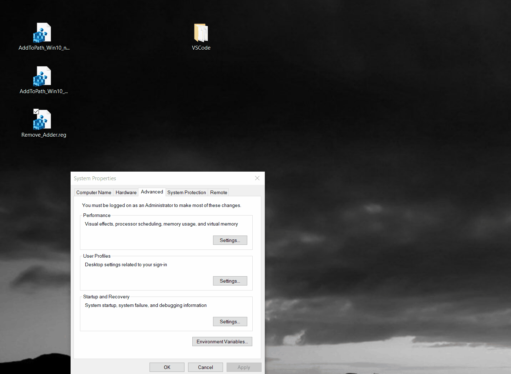

# AddToPath Win 10: Context Menu Extension for Easy Path Management

**AddToPath Win 10** is a user-friendly shell extension for Windows that simplifies the process of adding directories to your system's PATH environment variable. This tool is designed to enhance the Windows user experience by providing an easy-to-use "Add To Path" option in the context menu. It's a perfect solution for developers, system administrators, and any Windows user who frequently modifies their PATH.

### Key Features:
- **Seamless Integration**: Adds an "Add To Path" option directly in the Windows context menu.
- **User-Friendly**: Eliminates the need to navigate through multiple system settings.
- **Safe and Efficient**: Adds folder paths to the User's PATH variable, not system-wide, ensuring system integrity.
- **Duplicate Prevention**: Automatically prevents adding duplicate paths.
- **Multi-Selection Support**: Allows adding multiple folders to PATH at once.
- **Admin Rights Not Required**: Operates without needing administrative privileges.
- **Verbose and Silent Modes**: Choose between detailed console output or a quick, silent update.
- **Network Location Compatible**: Tested and supports network locations (e.g., SMB paths like `\\NasServer\some_dir`).

### How It Simplifies PATH Management:
Traditionally, adding a directory to the PATH variable involves several steps:
1. Navigating to "Control Panel" -> "System and Security" -> "System".
2. Accessing "Advanced system settings" -> "Environment Variables".
3. Modifying the "Path" variable under "User variables for \<Username\>".

**AddToPath Win 10** streamlines this process into a simple right-click action.

### Preview of AddToPath in Action:

### Download and Installation:
1. Get the latest release
2. Choose between one of the variants and open it
3. Allow it to be added to the registry

### How to Use AddToPath:
1. Choose a folder to be added to path
2. Right-click on that folder
3. Click AddToPath
4. Done
